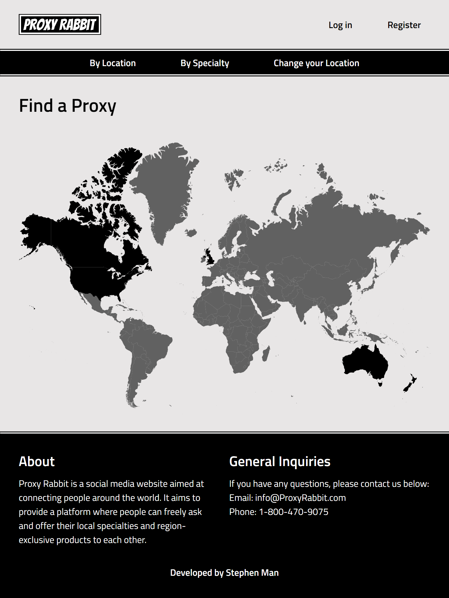
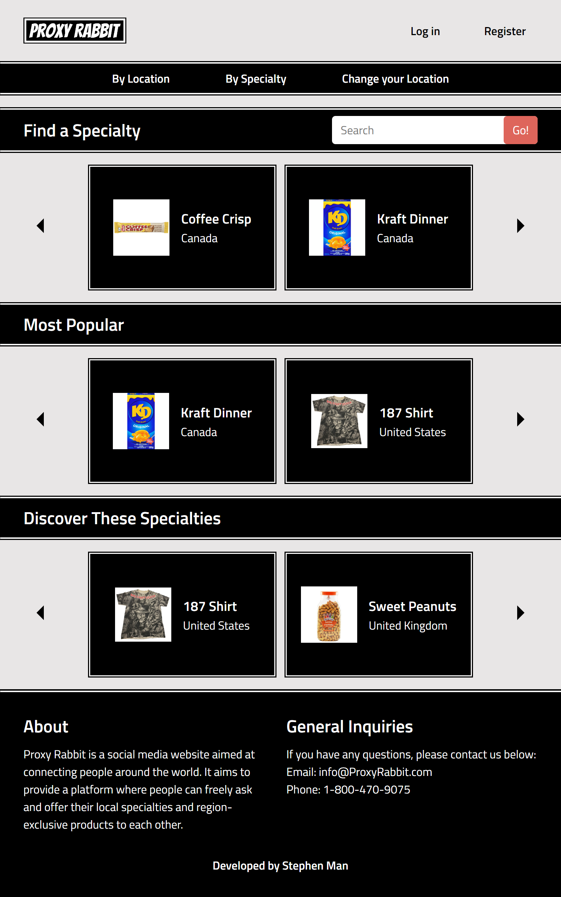
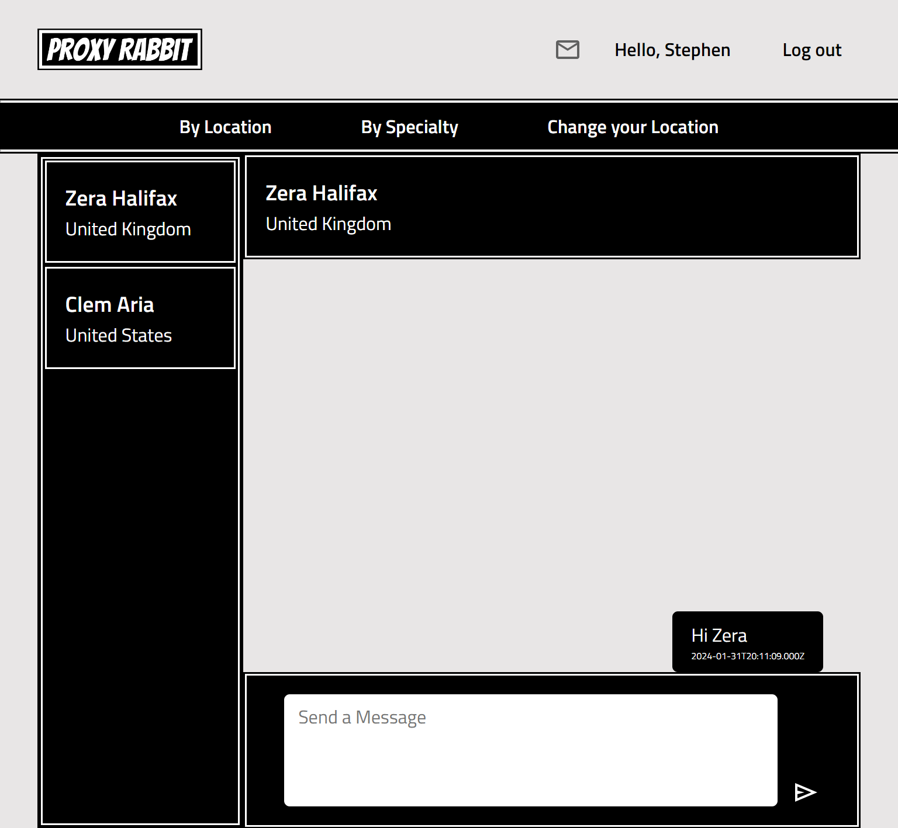
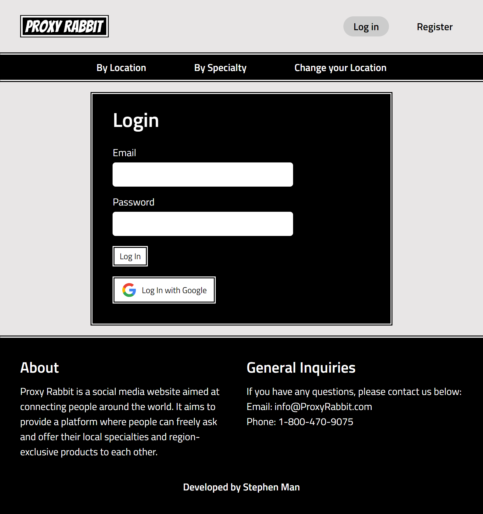
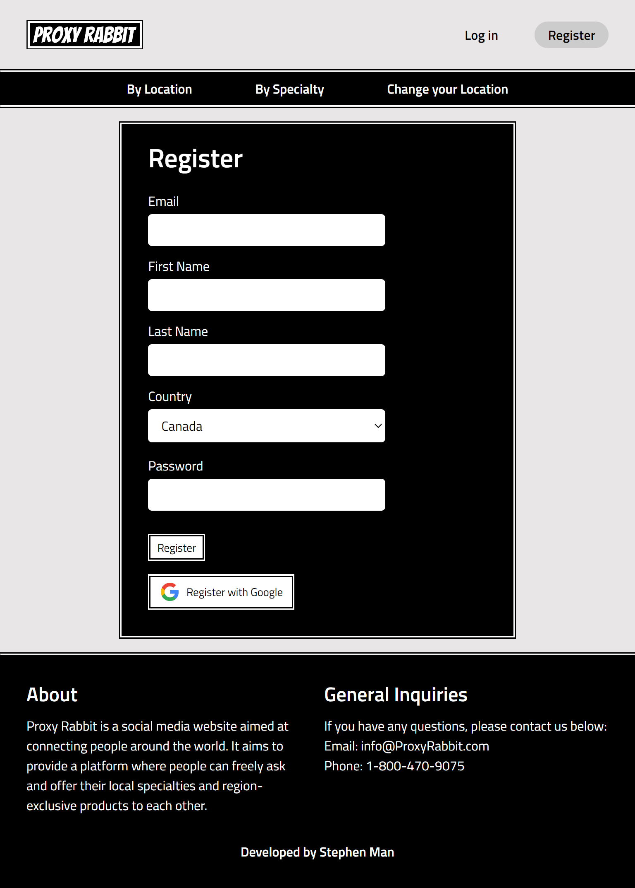
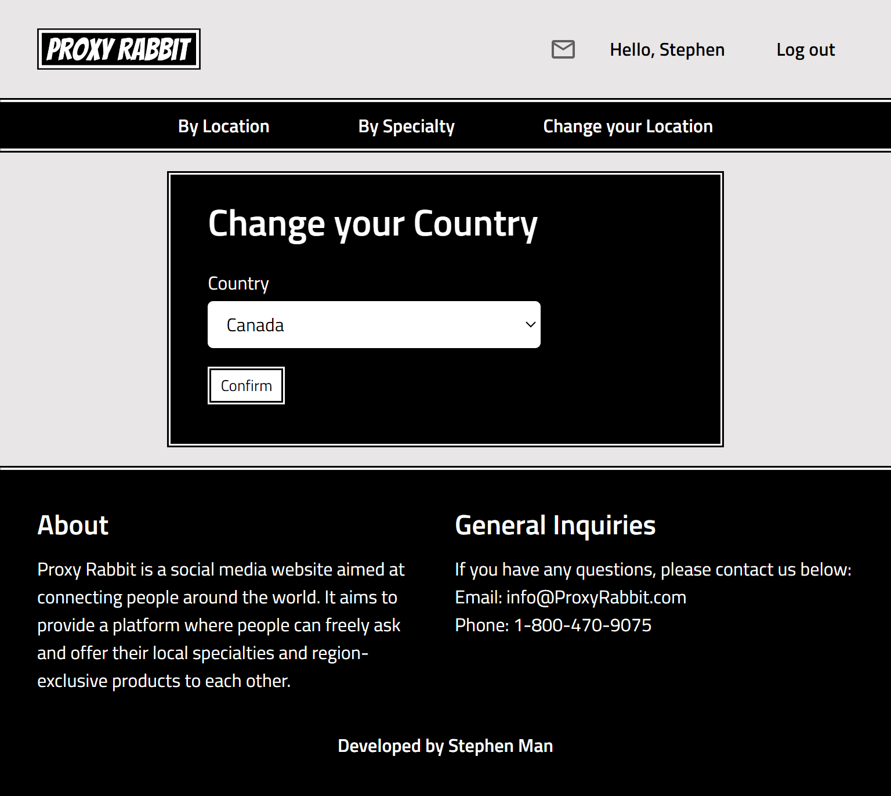
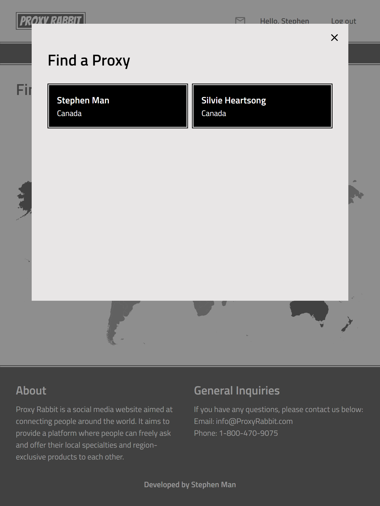
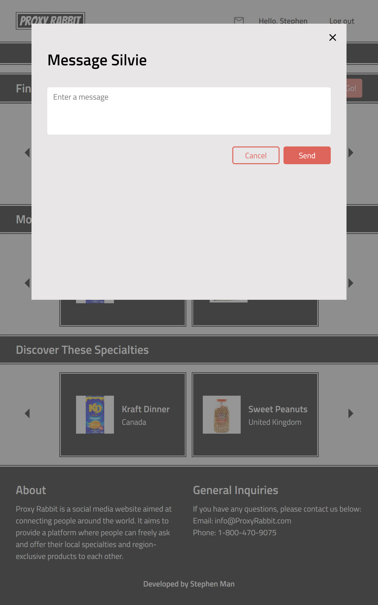

# Proxy Rabbit

## Overview

Two repos are required for this project:
https://github.com/SM10/proxy-rabbit
https://github.com/SM10/proxy-rabbit-api

Proxy Rabbit is a social media website aimed at connecting people around the world. It aims to provide a platform where people can freely ask and offer their local specialties and region-exclusive products to each other.

### Problem

Did you know that Coffee Crisp is only available in Canada? Despite being an amazing commercial success and a widely popular, it isn't sold overseas or even in America.

There are tons of products like these. Region-exclusive specialties that are unknown to the world. Proxy Rabbit provides a platform for people to learn about and buy these products from and for each other.

### User Profile

Proxy Rabbit is planned to be aimed at young adults, and while a mobile version will be available, it will focus primarily on a tablet and desktop experience.

### Features

Proxy Rabbit will provide 2 ways to search for a proxy, or another user from that region who will help purchase and mail a desired product. The first is by country, and the second will be by popular products.

Once the user has found a proxy, they can send them a message through Proxy Rabbit's built-in messenging system.

## Implementation

### Tech Stack

Front End:
React
SASS
Socket.IO
Axios
js-cookie

Back End:
Node.js
Express
Express Session
MySQL
Knex
Nodemon
Socket.IO
JSON Web Token
Google Apis (OAuth 2.0)
Crypto
Dotenv

### APIs

A RESTFUL API will be used for this. The API can be found here: https://github.com/SM10/proxy-rabbit-api

### Sitemap

The following pages will be necessary:

"Find a proxy by country"
"Find a proxy by product"
"Change my Location"
"Login"
"Register"
"Mailbox"
"Login Successful"
"Error"
"Page Not Found"

The home page will be "Find a proxy by country". This will be a single page application. There is a navigation bar that allows the user to switch between any of the 3 pages on demand.

### Mockups

Find a proxy by country:

Find a proxy by specialty:

Mailbox page:

Login page:

Registration page:

Change Your Location page:

Find A Proxy popup:

Send Message popup:

### Auth

Current supported authentication method is through web token and Google OAuth.

## Roadmap

January 19 - 22: Complete development and testing api requests.
January 22 - 25: Complete development of components and styling of front end.
January 26 - 30: Implementation of real-time messaging through Server.IO
January 31 - Feb 3: Implementation of Nice-to-haves

## Nice-to-haves

Your project will be marked based on what you committed to in the above document. Under nice-to-haves, you can list any additional features you may complete if you have extra time, or after finishing.

1. A rating system where users can rate each other as proxies.
2. Form for user to submit new region-exclusive products.
3. Expected price of products.